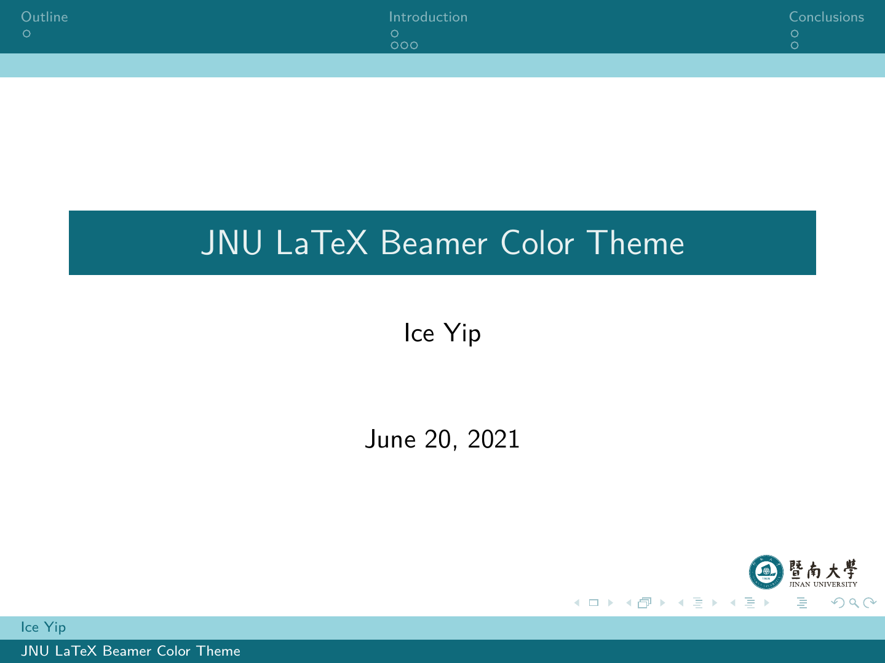

# JNU Beamer Color Theme

Jinan University Beamer Color Theme

暨南大学 Beamer 颜色主题

$\LaTeX$ Beamer presentation color theme derived from the [MIT Theme](https://github.com/jtriley/mit-beamer).

**NOTE:** This is just a beamer color scheme. It can work with other beamer themes.

这只是一个 LaTeX Beamer 配色方案。它可以与其它 LaTeX 主题一起使用。

## Preview

[Preview Link](slides.pdf)

<details>
  <summary>Preview Image</summary>




</details>

## Get Started

### Quick Start

`slides.tex` is a example beamer with JNU Logo, using `Berlin` as its style.

Fill `slides.tex` with your content, and then compile.

### Advanced Usage

Copy `beamercolothemejnu.sty` to the directory of your `tex` file.

Then insert these options to the preamble of your document:

```LaTeX
\usetheme{Berlin} % You can change it to other styles
\usecolortheme{jnu}
```

## Guides On LaTeX

不熟悉 LaTeX？ 请参考 [一份（不太）简短的 LATEX 2ε 介绍](http://mirrors.ctan.org/info/lshort/chinese/lshort-zh-cn.pdf)

LaTeX Beamer 的教程：[Beamer - Overleaf](https://www.overleaf.com/learn/latex/Beamer)
